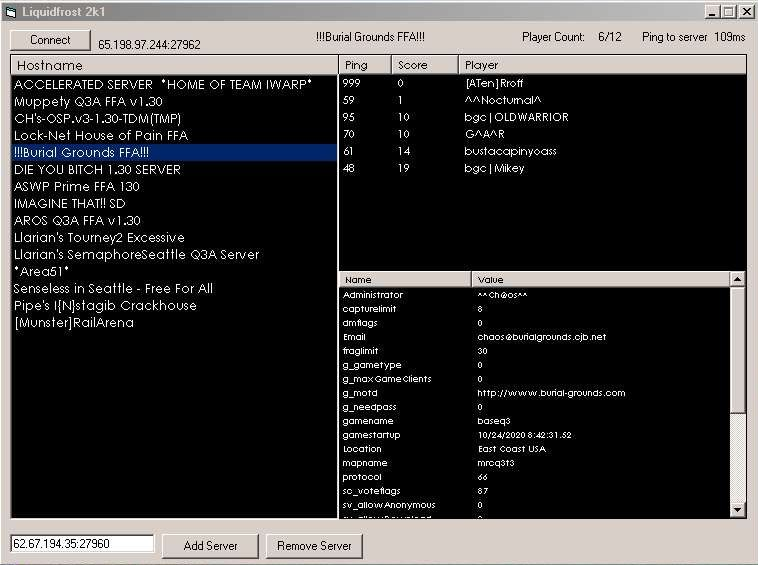



## Q3 Server Querry tool

### Description

This is a QUAKE 3 ARENA server querry tool and example kind of like gamespy. Displays information about the server, including...

1. players ,(in the server)

2. players ping, (in the server)

3. players frags ,(in the server)

3. players slot number,(in the server)

=) have fun cya in the game

RAD{N}
 
### More Info
 

             |
---                |---
**Submitted On**   |2001-10-25 02:29:30
**By**             |[LiquidFrost](https://github.com/Planet-Source-Code/PSCIndex/blob/master/ByAuthor/liquidfrost.md)
**Level**          |Advanced
**User Rating**    |4.0 (16 globes from 4 users)
**Compatibility**  |VB 5\.0, VB 6\.0
**Category**       |[Games](https://github.com/Planet-Source-Code/PSCIndex/blob/master/ByCategory/games__1-38.md)
**World**          |[Visual Basic](https://github.com/Planet-Source-Code/PSCIndex/blob/master/ByWorld/visual-basic.md)
**Archive File**   |[RAD3120310252001\.zip](https://github.com/Planet-Source-Code/liquidfrost-q3-server-querry-tool__1-28422/archive/master.zip)

